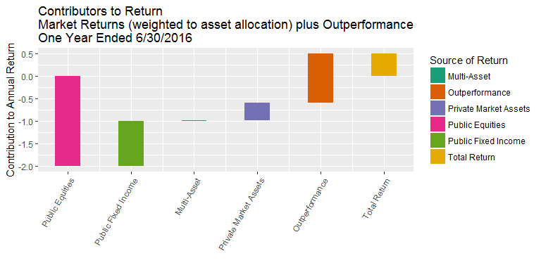
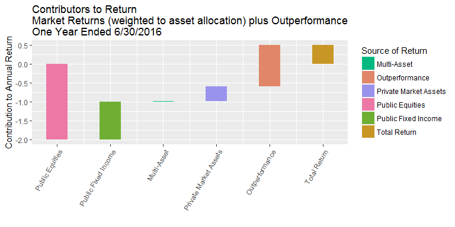
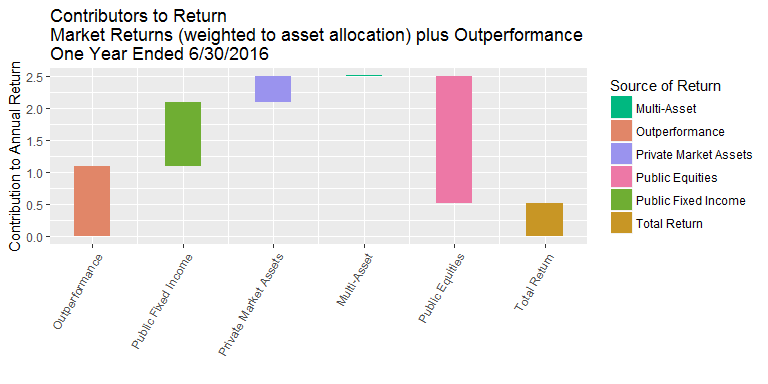
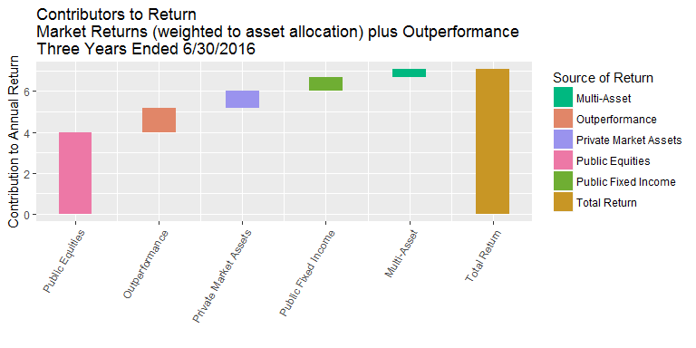

# Waterfall Graph and Color Palettes
Karl Polen  
September 12, 2016  

A waterfall graph is a popular way to show the consituents of a quantity.  

**ggplot2** does not have a geometry for this, but you can get by with **geom_rect**.  Here is an example that shows the contribution to ASRS return for the last year.


```r
require(scales)
require(RColorBrewer)
colorpalette=brewer.pal(8,'Dark2')
colorpalettem=muted(colorpalette,l=65,c=75) #if you use muted function, needs to be before you load ggplot2
require(ggplot2)
desc=c("Public Equities","Public Fixed Income","Multi-Asset","Private Market Assets","Outperformance","Total Return")
returns=c(-2,1,0.01,.4,1.1) #does not include the total
balance=data.frame(desc)
balance$id=1:length(desc)
balance$end=c(cumsum(returns),sum(returns))
balance$start=c(0,head(balance$end,-1))
balance$start[length(desc)]=0
ggplot(balance, aes(x=id))+
  geom_rect(aes(x=id,xmin=id-.2,xmax=id+.2,ymin=end, ymax=start,fill=desc))+
  scale_x_continuous("",breaks=balance$id,labels=desc)+
  scale_fill_manual(values=colorpalette,name="Source of Return")+
  ggtitle("Contributors to Return\nMarket Returns (weighted to asset allocation) plus Outperformance\nOne Year Ended 6/30/2016")+
  xlab("")+
  ylab("Contribution to Annual Return")+
  theme(axis.text.x=element_text(angle=60,hjust=1))
```

<!-- -->

Let's say you find these colors a little bright.

You can use the **muted** function from the **scales** package to tone them down.  (A weird thing is that **ggplot2** and **scales** conflict.  But if you run **muted** before you load **ggplot2**, it works.)

See the **muted** command in the preceding code chunk.  This version of the graph uses the muted color palette.


```r
ggplot(balance, aes(x=id))+
  geom_rect(aes(x=id,xmin=id-.2,xmax=id+.2,ymin=end, ymax=start,fill=desc))+
  scale_x_continuous("",breaks=balance$id,labels=desc)+
  scale_fill_manual(values=colorpalettem,name="Source of Return")+
  ggtitle("Contributors to Return\nMarket Returns (weighted to asset allocation) plus Outperformance\nOne Year Ended 6/30/2016")+
  xlab("")+
  ylab("Contribution to Annual Return")+
  theme(axis.text.x=element_text(angle=60,hjust=1))
```

<!-- -->

This graph is a little confusing because it starts with a leading negative value.  Let's try again sorting the values to put the positive values first.

Note the use of **scale_fill_manual** in all cases.  This causes the colors to be associated with asset class consistently, even if their order changes in the graph.  


```r
desc=c("Public Equities","Public Fixed Income","Multi-Asset","Private Market Assets","Outperformance","Total Return")
returns=c(-2,1,0.01,.4,1.1)
sortidx=sort.int(returns,decreasing=TRUE,index.return=TRUE)$ix
returns.sort=returns[sortidx]
desc.sort=c(desc[sortidx],desc[length(desc)])
balance=data.frame(desc.sort)
balance$id=1:length(desc)
balance$end=c(cumsum(returns.sort),sum(returns.sort))
balance$start=c(0,head(balance$end,-1))
balance$start[length(desc)]=0
ggplot(balance, aes(x=id))+
  geom_rect(aes(x=id,xmin=id-.2,xmax=id+.2,ymin=end, ymax=start,fill=desc.sort))+
  scale_x_continuous("",breaks=balance$id,labels=desc.sort)+
  scale_fill_manual(values=colorpalettem,name="Source of Return")+
  ggtitle("Contributors to Return\nMarket Returns (weighted to asset allocation) plus Outperformance\nOne Year Ended 6/30/2016")+
  xlab("")+
  ylab("Contribution to Annual Return")+
  theme(axis.text.x=element_text(angle=60,hjust=1))
```

<!-- -->

Here is another example with the decomposition of the three year ASRS total fund return.


```r
desc=c("Public Equities","Public Fixed Income","Multi-Asset","Private Market Assets","Outperformance","Total Return")
returns=c(4,.7,.4,.8,1.2)
sortidx=sort.int(returns,decreasing=TRUE,index.return=TRUE)$ix
returns.sort=returns[sortidx]
desc.sort=c(desc[sortidx],desc[length(desc)])
balance=data.frame(desc.sort)
balance$id=1:length(desc)
balance$end=c(cumsum(returns.sort),sum(returns.sort))
balance$start=c(0,head(balance$end,-1))
balance$start[length(desc)]=0
ggplot(balance, aes(x=id))+
  geom_rect(aes(x=id,xmin=id-.2,xmax=id+.2,ymin=end, ymax=start,fill=desc.sort))+
  scale_x_continuous("",breaks=balance$id,labels=desc.sort)+
  scale_fill_manual(values=colorpalettem,name="Source of Return")+
  ggtitle("Contributors to Return\nMarket Returns (weighted to asset allocation) plus Outperformance\nThree Years Ended 6/30/2016")+
  xlab("")+
  ylab("Contribution to Annual Return")+
  theme(axis.text.x=element_text(angle=60,hjust=1))
```

<!-- -->

